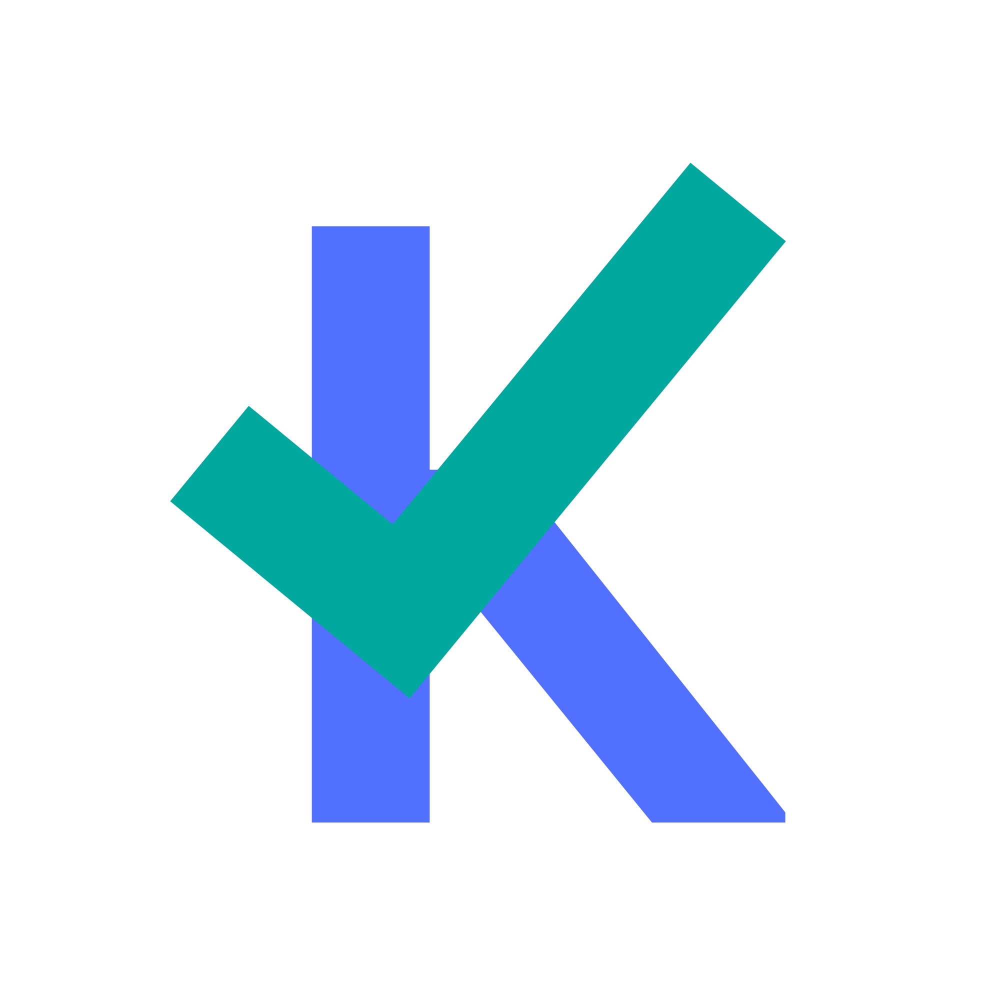
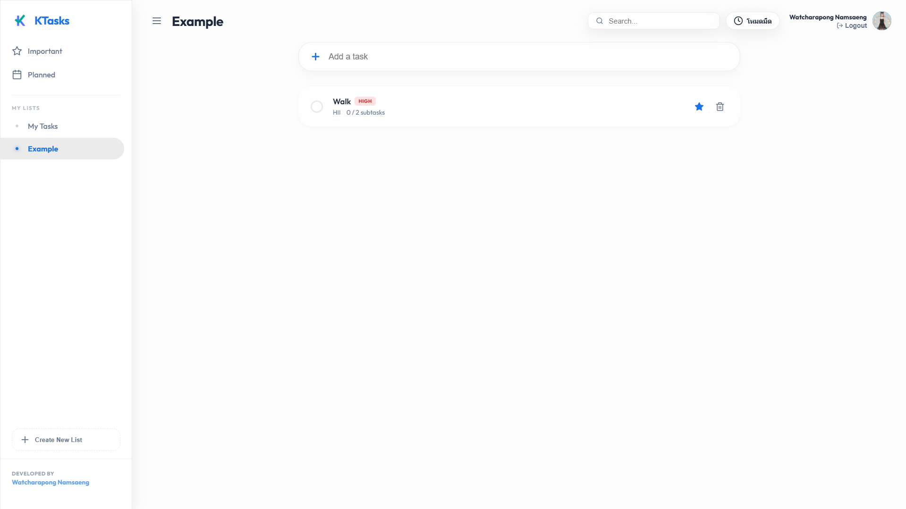

#  KTasks

The **Ultimate Productivity Powerhouse**. A beautifully crafted, high-performance task manager built with React (Vite) and MongoDB Atlas. KTasks is designed to be superior to Google Tasks by offering enterprise-grade features wrapped in a stunning glassmorphism UI.



## 🚀 The Vision

KTasks isn't just a simple to-do list. It's an entire ecosystem for productivity. From real-time collaboration with WebSockets to God-Tier gamification and AI task breakdowns, KTasks pushes the boundaries of modern web technologies.

## ✨ God-Tier Features (In Development & Completed)

### 📅 Advanced Organization
* **Due Dates & Times:** Precision scheduling down to the minute.
* **Smart Global Views:** Auto-filtering for **Today**, **Upcoming**, and **Important** tasks.
* **Tags & Labels:** Categorize and color-code workflows instantly.
* **Advanced Sorting:** Sort by priority, due date, or alphabetical order.

### ⚡ Power User Capabilities
* **Recurring Tasks:** Automate routines (Daily, Weekly, Monthly, Yearly).
* **Pomodoro Time Tracking:** Built-in timer to log actual time spent on tasks.
* **Task Dependencies:** Define prerequisite tasks (Blockers).
* **Kanban Board View:** Switch from list to a drag-and-drop Trello-style board.
* **Markdown Notes:** Rich text formatting in task descriptions.
* **File Attachments:** Upload images and documents directly to a task.

### 🎮 Gamification & Automation
* **RPG Leveling System:** Earn XP, level up, and unlock streak badges simply by being productive.
* **Voice-to-Task:** Add tasks instantly using your microphone.
* **Location-Based Reminders:** Get notified when you arrive at a specific GPS coordinate.
* **AI Task Breakdown:** Click the "Magic" button to have AI generate subtasks for complex goals.

### 🌐 Real-Time Ecosystem
* **Live Sync (Socket.io):** Collaborate with others in real-time without page reloads.
* **Activity Logs:** Timeline history of who created, edited, or completed tasks.
* **Two-Way Calendar Sync:** Push and pull from Google/Outlook Calendars.
* **Offline PWA Support:** Work seamlessly even without an internet connection.

---

## 🛠️ Tech Stack
* **Frontend:** React 18, Vite, Framer Motion (for buttery smooth micro-animations), Lucide Icons
* **Backend:** Node.js, Express 5, Socket.io
* **Database:** MongoDB Atlas (Mongoose)
* **Auth:** Google OAuth2.0

## ⚙️ Setup & Installation

Ensure you are running **Node 20+**.

1. **Install Dependencies**
   ```bash
   npm install
   cd server && npm install
   ```

2. **Environment Variables**
   Create a `.env` in the root and another in the `server/` directory:
   - `MONGODB_URI` (Your Atlas connection string. **Make sure your current IP is whitelisted!**)
   - `GOOGLE_CLIENT_ID`
   - `JWT_SECRET`
   - `VITE_GOOGLE_CLIENT_ID`
   - `VITE_API_URL` (usually `http://localhost:5000/api` for local dev)

3. **Development**
   Start the frontend (Port 5173):
   ```bash
   npm run dev
   ```
   Start the backend server (Port 5000):
   ```bash
   cd server
   node index.js
   ```

## 🚀 Production Deployment
To build for production, the app bundles the React frontend and serves it statically via the Express server:
```bash
npm run build
npm start
```

## 👨‍💻 Credits
Project Architect & Developer: **Watcharapong Namsaeng**.
